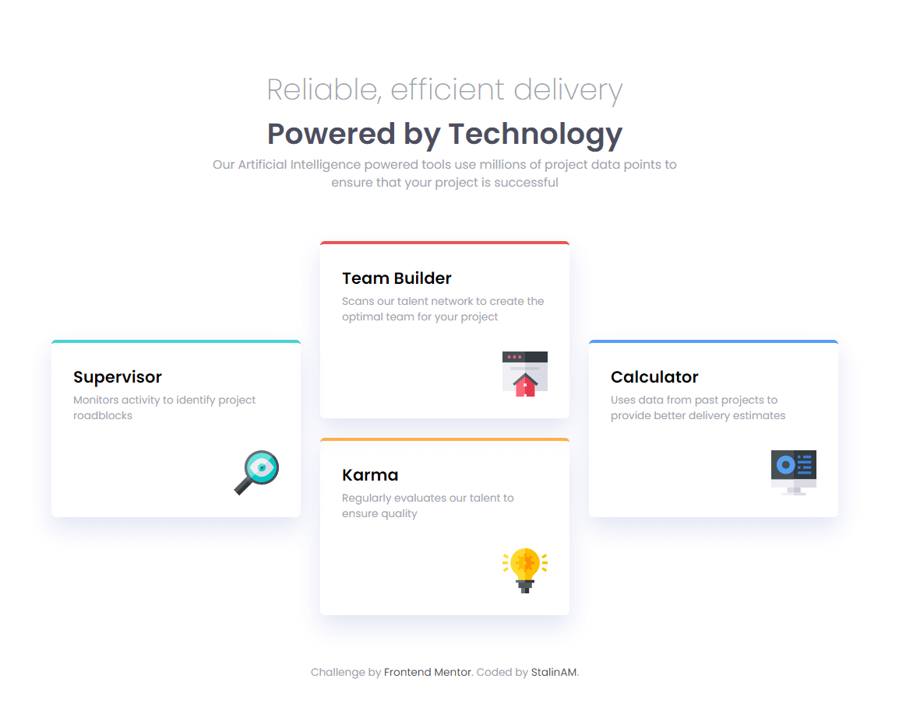
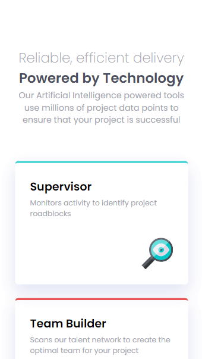

# Frontend Mentor - Four card feature section solution

This is a solution to the [Four card feature section challenge on Frontend Mentor](https://www.frontendmentor.io/challenges/four-card-feature-section-weK1eFYK). Frontend Mentor challenges help you improve your coding skills by building realistic projects. ## Table of contents

- [Frontend Mentor - Four card feature section solution](#frontend-mentor---four-card-feature-section-solution)
    - [Screenshot](#screenshot)
    - [Links](#links)
  - [My process](#my-process)
    - [Built with](#built-with)
    - [What I learned](#what-i-learned)
  - [Author](#author)

### Screenshot





### Links

- Solution URL: [GitHub](https://github.com/StalinAM/FourCardFeature.git)
- Live Site URL: [StalinAM](https://stalinam.github.io/FourCardFeature/)

## My process

### Built with

- Semantic HTML5 markup
- CSS custom properties
- CSS Grid
- Mobile-first workflow
- Responsive web design

### What I learned

Use of the @media ruler together with the display grid to place the cards in a cross shape.

```html
<main class="cards-container">
    <div class="green-card">
        <h1>Supervisor</h1>
        <p>Monitors activity to identify project roadblocks</p>
        
    </div>
    <div class="red-card">
        <h1>Team Builder</h1>
        <p>Scans our talent network to create the optimal team for your project</p>
        
    </div>
    <div class="orange-card">
        <h1>Karma</h1>
        <p>Regularly evaluates our talent to ensure quality</p>
        
    </div>
    <div class="blue-card">
        <h1>Calculator</h1>
        <p>Uses data from past projects to provide better delivery estimates</p>
        
    </div>
</main>
```

```css
@media (min-width: 1064px) {
    header {
        width: 640px;
    }

    header h1,
    header h2 {
        font-size: 3.6rem;
    }

    main {
        grid-template-columns: auto auto auto;
        grid-template-rows: repeat(4, auto);
    }

    .green-card {
        grid-row: 2 / 4;
    }

    .red-card {
        grid-column-start: 2;
        grid-row: 1 / 3;
    }

    .orange-card {
        grid-column: 2 / 3;
        grid-row: 3 / 5;
    }

    .blue-card {
        grid-column-start: 3;
        grid-row: 2 / 4;
    }
}
```

## Author

- GitHub - [StalinAM](https://github.com/StalinAM)
- Frontend Mentor - [@StalinAM](https://www.frontendmentor.io/profile/StalinAM)